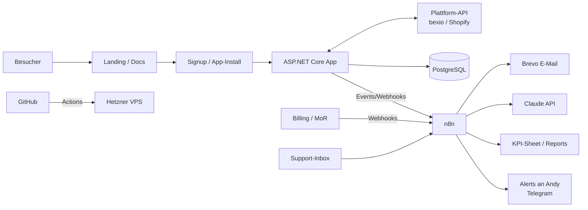

# FLOW100 – Automatisiertes Online-Business: Von der Idee zum Umsetzungsplan

**Stand:** 11.09.2026 · **Rahmen:** 5–10 h/Woche neben dem Job · Budget < CHF 1'000 (Jahr 1) · Modell & Markt offen

---

## 0. Kurzfazit

1. **Empfohlenes Modell: Marketplace-first Micro-SaaS** – eine kleine Integrations-App für eine etablierte Plattform (z. B. bexio, Shopify). Die Plattform liefert die Nachfrage, du lieferst die Integration. Das passt direkt zu deinen Stärken (.NET, REST-APIs, SQL, Integrationen), hat wiederkehrenden Umsatz und lässt sich weitgehend automatisieren.
2. **Nicht bauen, bevor validiert.** Bauen ist 2026 billig geworden, darum ist Distribution der Engpass. Beispiel aus der Recherche: Für E-Rechnungen (ZUGFeRD/XRechnung) gibt es im Shopify App Store mindestens 7 Apps, darunter Neulinge vom Mai 2026 mit 1 Review. „Offensichtliche“ Ideen sind schon besetzt.
3. **Budget Jahr 1: ca. CHF 800** inkl. 15 % Puffer. Fixkosten liegen bei ca. CHF 25–35/Monat.
4. **Realistische Erwartung (Einschätzung):** Im Basisszenario hast du in Monat 12 etwa 15 zahlende Kunden und CHF 435 MRR. Ein Einkommensersatz ist im Jahr 1 unrealistisch. Das Ziel für Jahr 1 ist ein **validiertes, zahlendes, automatisiertes Produkt**.
5. **Automatisierung:** Zielwert ca. 80 % der *wiederkehrenden* Abläufe (Onboarding, Billing, Support-Triage, Monitoring, Reporting, Deployment). Kundengespräche, Produktentscheide und Freigaben bleiben bei dir. Regel: **Erst automatisieren, wenn du etwas 3× manuell gemacht hast.**
6. **Diese Woche:** Arbeitsvertrag prüfen (Nebenbeschäftigung, Konkurrenz, IP). Danach die Discovery für die Hypothesen H1 bis H3 starten.

---

## 1. Ausgangslage: Fakten vs. Annahmen

| Typ | Punkt |
|---|---|
| Fakt | 5–10 h/Woche verfügbar, Budget < CHF 1'000 für 12 Monate |
| Fakt | Skills: C#, .NET, WPF, MVVM/Prism, SQL Server, REST-APIs, technische Integrationen |
| Fakt | Standort Schweiz, Deutsch; Modell und Zielmarkt offen |
| Annahme | Der Vollzeitjob bleibt. Planungswert **8 h/Woche ≈ 416 h/Jahr** |
| Annahme | Solo, kein Co-Founder, kein Fremdkapital |
| Annahme | Claude (Pro/Code) ist bereits vorhanden und nicht im Budget enthalten |
| Annahme | Englisch reicht für Doku und Code; FR-Übersetzung per KI plus Review ist möglich |
| Risiko-Annahme | Dein Arbeitgeber ist im CRM-Umfeld tätig. CRM-nahe Ideen sind deshalb bis zur Vertragsprüfung **ausgeschlossen** |

---

## 2. Geschäftsmodelle im Vergleich

Skala 1–5 (5 = passt am besten zu deinem Rahmen). Gewichtung: Automatisierbarkeit 25 %, Skill-Fit 20 %, Kapitalbedarf 15 %, Zeit bis Umsatz 15 %, Skalierung/Recurring 15 %, Wettbewerb/Risiko 10 %.

| Rang | Modell | Auto | Skill | Kapital | Zeit→€ | Skalierung | Risiko | **Score** |
|---|---|---|---|---|---|---|---|---|
| 1 | **Marketplace-first Micro-SaaS (Integration)** | 4 | 5 | 5 | 3 | 5 | 3 | **4.25** |
| 2 | Standalone Micro-SaaS (eigene Distribution) | 4 | 5 | 5 | 2 | 5 | 2 | 4.00 |
| 3 | Digitale Produkte (Dev-Kits, Templates) | 5 | 4 | 5 | 3 | 2 | 3 | 3.85 |
| 4 | Productized Service (Automationen für KMU) | 2 | 5 | 5 | 5 | 2 | 4 | 3.70 |
| 5 | Newsletter / Paid Community | 3 | 3 | 5 | 2 | 3 | 2 | 3.05 |
| 6 | Content/SEO/Affiliate (Rechner-/Ratgeber-Sites) | 4 | 2 | 5 | 1 | 3 | 1 | 2.85 |
| 7 | E-Commerce / Print-on-Demand | 3 | 1 | 2 | 3 | 3 | 2 | 2.35 |

**Begründungen (Einschätzung):**

- **Standalone-SaaS** verliert gegen die Marketplace-Variante, weil du mit 8 h/Woche kaum eigene Reichweite aufbauen kannst.
- **Digitale Produkte** lassen sich am besten automatisieren, erzeugen aber Einmalumsatz und brauchen eine Audience. Sie eignen sich darum als **Nebenprodukt** (siehe H3), nicht als Kern.
- **Productized Service** bringt am schnellsten Geld, skaliert aber über deine Stunden. Das ist der **Fallback**, falls 3 Hypothesen durchfallen, und ein guter Weg, echte Pains kennenzulernen.
- **Content/SEO:** Die Recherche zeigt, dass Schweizer Ratgeber-Nischen (Nebenerwerb, MWST, Steuern) 2026 bereits voll mit KI-generierten Sites sind. Das dauert lange und bringt schwache Monetarisierung.
- **E-Commerce:** Lager- und Werbekosten sprengen das Budget, und deine Skills bringen dort kaum Vorteil.

---

## 3. Strategie: Warum „Marketplace-first“

**Vorteile**

- **Nachfrage ist geliehen:** bexio hat über 100'000 Kunden, über 1'000 zertifizierte Treuhandpartner und 100+ Apps im Marketplace. Shopify verlangt **0 % Revenue Share** auf die ersten USD 1 Mio. Umsatz (kumuliert ab 1.1.2025) und eine einmalige Gebühr von USD 19.
- **Self-Serve:** Die Kette Installation → OAuth → Onboarding → Billing lässt sich vollständig automatisieren.
- **Trend 2026:** Vertikale, eng fokussierte Tools gewinnen. Generische KI-Wrapper und breite „Productivity“-Tools verlieren (siehe mean.ceo, Micro-SaaS-Trends Sept. 2026). Gefragt sind Reporting-Schichten für vertikale Systeme, Compliance-Nachweise und Datenbereinigung.
- **Unfair Advantage:** Integration, Sync, Datenmodellierung und Zuverlässigkeit sind dein Kerngeschäft.

**Nachteile / Gegenmassnahmen**

- **Plattformabhängigkeit** (API-Änderungen, Regeln) → nur offizielle APIs verwenden, eine Adapter-Schicht bauen und keinen Kern-Workflow auf undokumentierte Endpoints stützen.
- **Feature-Absorption** (die Plattform baut dein Feature nach) → Workflows wählen, die über die Plattform hinausgehen (z. B. Kommunikation mit Dritten, Multi-Mandant).
- **Listing-Hürden:** bexio listet erst ab **mind. 10 Kunden und 20 aktiven Usern**. Die App muss in mind. 2 Sprachen verfügbar sein, der Marketplace-Content in 4. Die ersten Kunden musst du also selbst gewinnen.

---

## 4. Ideen-Shortlist (Hypothesen, noch nicht validiert)

**Verworfen nach Desk-Check:**

- **Shopify E-Rechnung:** mindestens 7 Apps, der Markt ist gesättigt.
- **bexio → Power BI:** existiert bereits als Marketplace-App und als Make/Zapier-Integration.

### H1 – bexio „Beleg-Autopilot“ für Treuhandbüros (Favorit)

- **Zielkunde:** Treuhandbüros mit 20–200 bexio-Mandanten.
- **Job-to-be-done:** „Ich will ohne Nachtelefonieren sehen, welchen Mandanten Belege fehlen, und die Belege automatisch einsammeln.“
- **Kern-Workflow:** Täglicher Sync über die bexio-API → Regel „Buchung/Bankbewegung ohne Beleg“ → automatische, freundliche Erinnerung an den Mandanten mit Upload-Link → Beleg landet in bexio → Status im Treuhänder-Cockpit.
- **Preis-Hypothese:** CHF 49–99/Monat pro Büro (höherer ARPA als bei KMU-Apps).
- **Warum du:** OAuth/OpenID Connect, Multi-Tenant-Sync, Regel-Engine, SQL.
- **Kritisch prüfen:**
  - Liefert die API die nötigen Daten (Buchungen, Belege, Mandantenzugriff für Treuhänder)?
  - Bietet bexio das selbst oder gibt es etablierte Treuhand-Tools, die das schon lösen?
  - Wie hoch ist die Sicherheitshürde bei Finanzdaten?

### H2 – Kauf auf Rechnung mit Swiss QR-Rechnung + automatischem Zahlungsabgleich (Shopify/WooCommerce CH)

- **Zielkunde:** CH-Onlinehändler mit B2B- oder Rechnungskauf.
- **Kern-Workflow:** Bestellung → QR-Rechnung erzeugen → Zahlungseingang abgleichen (camt.054) → Bestellung auf „bezahlt“ setzen → Mahnstufe.
- **Preis-Hypothese:** CHF 19–39/Monat.
- **Kritisch prüfen:**
  - Bestehende Apps und Payment-Provider mit Rechnungskauf.
  - Zugang zu Bankdaten (manueller camt-Upload vs. Bank-API) ist die grösste technische Hürde.
  - Der CH-Shopify-Markt ist klein.

### H3 – .NET „Integration-SaaS Starter Kit“ (Nebenprodukt, global)

- **Produkt:** Multi-Tenant ASP.NET Core, OAuth-Connector-Framework, Webhooks, Background-Jobs, Billing-Anbindung, Docker/CI-Setup, dazu CLAUDE.md und Agent-Prompts.
- **Preis-Hypothese:** Einmalig USD 149–249, vollautomatische Auslieferung über einen Merchant of Record.
- **Wichtig:** Das Kit entsteht als Nebenprodukt aus dem H1/H2-Code. **Nicht parallel starten**, sondern frühestens ab Monat 7 entscheiden.
- **Kritisch prüfen:** Der Markt für .NET-Boilerplates ist kleiner als im JS-Umfeld.

### Ideen-Nachschub (Discovery-System, teilautomatisiert)

1. **Plattformen scannen:** bexio, Shopify (CH/DACH), Microsoft AppSource/Outlook-Add-ins, Azure DevOps.
2. **Review-Mining:** Top-Apps pro Kategorie, 1- bis 3-Sterne-Reviews, Feature-Wünsche in Community-Foren. Daten manuell exportieren oder kopieren (**Nutzungsbedingungen beachten, kein aggressives Scraping**).
3. **Mit Claude clustern** (Prompt A im Anhang) → Pain-Liste mit Häufigkeit und Zahlungsbereitschafts-Signalen.
4. **Scoring:** Pain-Häufigkeit × Zahlungsbereitschaft × API-Machbarkeit × (1/Wettbewerb).

---

## 5. Validierung (Woche 1–5) mit harten Go/No-Go-Kriterien

| Schritt | Inhalt | Aufwand |
|---|---|---|
| 1. Desk-Check | Wettbewerber zählen (Marketplace, Google, Zapier/Make-Templates), Reviews sammeln, API-Doku prüfen (Endpoints, Scopes, Rate Limits) | 2–3 h/Idee |
| 2. API-Spike | OAuth-Login + 1 Kern-Endpoint in einer Konsolen-App (.NET) | 4 h |
| 3. Pain-Interviews | 8–10 Gespräche à 20 min (LinkedIn, Netzwerk, bexio-Community, Treuhand-Stammtische/Verbände) | 5–6 h |
| 4. Smoke-Test | Landingpage mit konkretem Nutzen, Preis und Button „Pilotplatz reservieren“ | 3 h |
| 5. Pre-Sale | „Founding Customer“: 50 % Rabatt für 12 Monate, verbindliche Pilotzusage mit Preis | im Interview |

**GO nur, wenn alle Kriterien erfüllt sind:**

- ≥ 6 von 10 Interviewten haben das Problem **mindestens monatlich** und beziffern den Aufwand auf ≥ 1 h/Monat.
- ≥ **3 verbindliche Commitments** (Vorauszahlung, unterschriebene Pilotzusage mit Preis oder LOI).
- Der Kern-Workflow ist über die **offizielle API** machbar (API-Spike erfolgreich).
- Kein etablierter Anbieter löst den Kernjob gut (Faustregel: ≥ 4.5★ bei > 50 Reviews), **oder** es gibt eine klare, von Kunden bestätigte Differenzierung.

**NO-GO:** Weiter zur nächsten Hypothese (verkürzt, ca. 3 Wochen). Nach 3 No-Gos wechselst du auf den **Productized Service**: bezahlte Automations-Aufträge für KMU, um echte Pains zu finden und später daraus ein Produkt zu machen.

> Wichtig: „Klingt spannend“ und Newsletter-Signups sind **keine** Validierung. Nur Geld oder eine verbindliche Zusage zählen.

---

## 6. MVP-Definition (Woche 6–13, Beispiel H1)

**Scope-Regel:** 1 Kern-Workflow, 1 Plattform, 1 Sprache (DE). FR folgt vor dem Marketplace-Listing.
**Nicht im MVP:** Rollen/Rechte, Mobile, Multi-Plattform, Custom-Reports, fancy Admin-UI.

| Epic | User Story | Akzeptanzkriterien |
|---|---|---|
| E1 Onboarding | Als Treuhänder verbinde ich mein bexio-Konto per Login | OpenID Connect/OAuth erfolgreich; Tokens verschlüsselt gespeichert; Mandanten werden innerhalb von 5 min angezeigt |
| E2 Sync | Das System synchronisiert Buchungen und Belege täglich | Inkrementeller Sync; Retry mit Backoff; Sync-Log pro Mandant; keine Duplikate (idempotent) |
| E3 Regel-Engine | Ich sehe pro Mandant alle Buchungen ohne Beleg | Liste filterbar nach Mandant/Datum/Betrag; manuelle Ausnahme („kein Beleg nötig“) möglich |
| E4 Erinnerung | Mandanten erhalten automatisch eine Erinnerung mit Upload-Link | Konfigurierbarer Rhythmus (z. B. 3/7/14 Tage); signierter, ablaufender Link; Upload landet am richtigen Ort in bexio |
| E5 Cockpit | Ich sehe den Status über alle Mandanten | Ampel pro Mandant; Anzahl offener Belege; letzte Erinnerung |
| E6 Billing | Ich bezahle ein Monats- oder Jahresabo | Rechnung automatisch (bei CH-B2B: QR-Rechnung); Zugang wird bei Nichtzahlung nach Frist gesperrt |
| E7 Betrieb | Das System läuft ohne Handarbeit | Health-Checks, Alerts, nächtliches Backup, monatlicher Restore-Test |

---

## 7. Tech-Stack (Low-Cost, wartbar)

| Bereich | Wahl | Kosten/Monat | Begründung |
|---|---|---|---|
| Backend | ASP.NET Core (.NET 10 LTS), Minimal APIs, EF Core | 0 | Dein Kern-Stack, LTS |
| UI | Blazor Static SSR oder Razor Pages (kein SPA-Framework) | 0 | Weniger Komplexität, eine Sprache |
| DB | PostgreSQL (Docker) | 0 | Weniger RAM als SQL Server; Express-Edition hat 10-GB-Limit; EF Core abstrahiert |
| Background-Jobs | Hangfire (Postgres-Storage) | 0 | Retries, Dashboard, bekannt aus .NET |
| Hosting | Hetzner CX23 (2 vCPU/4 GB), Docker Compose, Caddy (Auto-TLS) | ≈ EUR 6 | Günstig, EU-Standort (DSG/DSGVO) |
| CI/CD | GitHub Actions → GHCR → Deploy per SSH | 0 | Push to deploy |
| Automationen | n8n Community Edition, self-hosted auf demselben VPS | 0 | Keine Execution-Limits (Cloud ab USD 20–24/Monat) |
| Landing/Docs | Statische Site (z. B. Astro) auf Cloudflare Pages | 0 | Schnell, gratis |
| E-Mail | Brevo Free (300 Mails/Tag); Alternative MailerLite Free (250 Abonnenten, 2'500 Mails/Monat) | 0 | Reicht bis ca. Monat 6 |
| Analytics / Monitoring | Umami + Uptime Kuma (self-hosted), Sentry o. ä. Free-Tier | 0 | Datensparsam |
| KI | Claude API (Support-Triage, Content-Entwürfe, Analysen) | ≈ CHF 15 | Nutzungsbasiert |
| Backups | restic → externer Object Storage | ≈ CHF 3 | 3-2-1-Prinzip |

**Billing hängt vom Kanal ab:**

- **Shopify-App:** Shopify Billing API ist Pflicht, kein Merchant of Record (MoR) nötig.
- **CH-B2B (H1):** Jahres- oder Monatsrechnung als QR-Rechnung, automatisiert über die bexio-API und n8n (Dogfooding). MWST ist erst ab CHF 100'000 Umsatz relevant.
- **Global/Digitalprodukt (H3):** Merchant of Record übernimmt EU-VAT und US-Sales-Tax. Stand 2026:
  - **Polar:** 5 % + 50¢ (Free-Tier), günstiger in bezahlten Tiers.
  - **Lemon Squeezy:** 5 % + 50¢, +1.5 % bei internationalen Karten, +0.5 % bei Abos. Wird in Stripe Managed Payments überführt → Migrationsrisiko.
  - **Stripe Managed Payments:** 3.5 % zusätzlich zu den Stripe-Gebühren. Verfügbarkeit für CH-Verkäufer vor Anmeldung prüfen.

---

## 8. Automatisierungs-Architektur



| # | Flow | Trigger | Automatisierte Schritte | Mensch |
|---|---|---|---|---|
| F1 | Lead-Capture | Formular Landingpage | Double-Opt-in → Tagging nach Antworten → Welcome-Sequenz (3 Mails) | – |
| F2 | Aktivierungs-Onboarding | Signup-Event | Checkliste per Mail; falls nach 48 h nicht verbunden → Hilfe-Mail + Link zum Loom-Video | Ab Tag 7 persönliche Mail (Vorlage) |
| F3 | Payment → Provisioning | Zahlung/Abo-Webhook | Zugang freischalten, Kunde in KPI-Sheet, Danke-Mail, Alert | – |
| F4 | Dunning / Win-back | Zahlung fehlgeschlagen / Kündigung | Erinnerungen (MoR/Shopify) → Exit-Survey → Claude fasst monatlich zusammen | Liest Zusammenfassung |
| F5 | Support-Triage | Neue Mail | Claude klassifiziert (Bug/Frage/Billing/Feature) → Antwortentwurf aus Doku; ab hoher Konfidenz Auto-Antwort bei FAQ, sonst Ticket | Beantwortet Tickets, Wochendigest |
| F6 | Feature-Requests | Tag „Feature“ | Deduplizieren/clustern → GitHub Issue mit Stimmenzähler | Priorisiert monatlich |
| F7 | Content-Engine | Wöchentlich | Fragen aus Support/Interviews → Claude-Entwurf (Blog/LinkedIn) → Review-Queue → Publish/Schedule | 15 min Freigabe |
| F8 | Wettbewerbs-Monitor | Wöchentlich | RSS/Changelogs/Listings prüfen (im Rahmen der AGB) → Diff → Digest | Liest Digest |
| F9 | Health & Self-Healing | Uptime-Check / Error-Rate | Alert → Container-Neustart → Eskalation, falls weiter down | Nur bei Eskalation |
| F10 | Backups | Nächtlich | DB-Dump → Offsite; monatlicher automatischer Restore-Test mit Report | Prüft Report |
| F11 | Finanzen & KPIs | Montag 07:00 | Umsätze/Kosten → Sheet → MRR, Churn, Aktivierung, Support-Zeit → Report-Mail | 10 min lesen |
| F12 | Deployment | Push auf `main` | Build → Tests → Image → Deploy → Smoke-Test → Rollback bei Fehler | Code-Review |

**Automatisierungs-Reihenfolge:** F12, F9, F10 (Betrieb) → F3, F1 (Geld & Leads) → F2, F5 (Kunden) → F11, F7, F8, F6, F4.

---

## 9. Umsetzungsplan

### Phasen (12 Monate)

| Phase | Zeitraum | Ziel | Deliverables | Checkpoint |
|---|---|---|---|---|
| 0 Setup | W1 | Rahmen geklärt | Vertrag geprüft, Repo, Tracking-Sheet, Domain | – |
| 1 Validierung | W1–W5 | 1 Idee mit GO | Desk-Check, API-Spike, 10 Interviews, Landing, ≥ 3 Commitments | **Go/No-Go W5** |
| 2 MVP & Piloten | W6–W13 | 5 Piloten nutzen das Produkt, ≥ 3 zahlen | MVP (E1–E7), F12/F9/F10/F3/F1 | **Ende M4: ≥ 3 Zahlende** |
| 3 Automatisieren | M4–M6 | Self-Serve-Onboarding | FR-Übersetzung, F2/F5/F11, Doku, Listing vorbereiten | **M6: ≥ 5 zahlende Kunden** |
| 4 Wachstum & Listing | M7–M9 | Marketplace-Listing, Preis-Tiers | Marketplace-Antrag (ab 10 Kunden / 20 Usern), Empfehlungsprogramm, F7/F8/F6, Entscheid zu H3-Kit | **M9: ≥ 10 Kunden · ≥ CHF 250 MRR** |
| 5 Skalieren oder Pivot | M10–M12 | Entscheid Jahr 2 | Jahrespläne, Preiserhöhung für Neukunden, Retro | **M12: Scale / Pivot / Kill** |

### 90-Tage-Plan (≈ 8 h/Woche)

| Woche | Fokus | Konkrete Aufgaben | Output |
|---|---|---|---|
| W1 | Setup + Desk-Check | Arbeitsvertrag prüfen; GitHub-Repo `flow100`; Tracking-Sheet; Wettbewerb & API-Doku H1/H2 (Prompt A) | Entscheid, welche Hypothese zuerst |
| W2 | API-Spike + Vorbereitung | bexio OAuth + Kern-Endpoint (Konsolen-App); Interviewleitfaden; 25 Kontakte listen; Landingpage-Entwurf | Machbarkeit ja/nein |
| W3 | Interviews I | 5 Interviews; Landingpage live; 1 LinkedIn-Post zum Problem | Notizen im Sheet |
| W4 | Interviews II + Pre-Sale | 5 Interviews; Founding-Customer-Angebot; Auswertung mit Prompt B | Commitments |
| W5 | **Go/No-Go** | Kriterien prüfen; bei GO: MVP-Scope einfrieren; bei No-Go: H2 ab W2 | Entscheid-Dokument |
| W6 | Fundament | VPS, Docker Compose, Caddy, Postgres, CI/CD (F12), Health/Backups (F9/F10), Login via OIDC | Deploy auf Knopfdruck |
| W7 | Sync (E2) | Sync-Service + Hangfire-Jobs, idempotente Upserts, Sync-Log | Daten für Pilot 1 |
| W8 | Regel-Engine (E3) | „Buchung ohne Beleg“, Ausnahmen, Listenansicht | Erster Nutzen sichtbar |
| W9 | Erinnerungen (E4) | Mail-Templates, signierte Upload-Links, Upload nach bexio | Kern-Workflow Ende-zu-Ende |
| W10 | Cockpit + Billing (E5/E6) | Ampel-Übersicht; Rechnung/Abo; AGB & Datenschutzerklärung; F3/F1 | Zahlungsfähig |
| W11 | Piloten 1–3 | Concierge-Onboarding (persönlich), Bugs fixen, Onboarding-Schritte notieren | Feedback-Log |
| W12 | Piloten 4–5 | Onboarding-Checkliste → F2 vorbereiten; Support-Mails sammeln (Basis für F5) | Aktivierungsrate |
| W13 | Retro & Pricing | KPIs, Preisentscheid, Plan für Phase 3 (Listing, FR) | Phase-3-Backlog |

---

## 10. Budget Jahr 1 (CHF, grobe Wechselkurs-Annahme 1 EUR = 0.95, 1 USD = 0.80)

| Posten | CHF |
|---|---|
| Domains (2×) | 40 |
| Hetzner CX23 inkl. IPv4 (EUR 5.99 × 12) | 68 |
| Offsite-Backup (~3/Monat) | 36 |
| Claude API (~15/Monat) | 180 |
| E-Mail-Tool-Reserve (Upgrade ab M7) | 60 |
| Validierungs-Ads (optional, nur bei Bedarf) | 200 |
| Shopify Partner Fee (nur bei Shopify-Weg) | 15 |
| Rechtstexte AGB/Datenschutz (Generator/Vorlage) | 100 |
| **Summe** | **699** |
| Puffer 15 % | 105 |
| **Total** | **≈ 804** |

Variable Kosten (nicht enthalten): MoR- oder Payment-Gebühren von ca. 3–8 % des Umsatzes.

---

## 11. Szenarien & KPIs

**Szenarien (Annahmen: ARPA CHF 29/Monat, zahlende Kunden ab Monat 4, linearer Aufbau, ~8 % Gebühren).** Bei H1 mit CHF 49–99 skalieren die Werte entsprechend. Die Checkpoints im Umsetzungsplan entsprechen dem Basisszenario (M6: 5 Kunden, M9: 10 Kunden / CHF 290 MRR).

| Szenario | Kunden M12 | MRR M12 | Netto-Umsatz J1 | Ergebnis J1 (vs. ≈ CHF 804 Kosten) |
|---|---|---|---|---|
| Pessimistisch | 3 | CHF 87 | ≈ CHF 400 | ≈ −400 → Pivot/Kill |
| Basis | 15 | CHF 435 | ≈ CHF 2'000 | ≈ +1'200 |
| Optimistisch | 40 | CHF 1'160 | ≈ CHF 5'300 | ≈ +4'500 |

**KPIs mit Zielwerten (Startwerte, nach 3 Monaten kalibrieren):**

| KPI | Ziel |
|---|---|
| Interviews → Commitments | ≥ 30 % |
| Aktivierung (Kern-Workflow innerhalb 24 h verbunden) | ≥ 60 % |
| Trial → Paid | ≥ 20 % |
| Monatlicher Churn | < 3 % |
| Support-Zeit | < 1 h/Woche |
| Anteil automatisch erledigter Support-Anfragen | ≥ 50 % ab M6 |
| Eigene Zeit für Betrieb (nicht Entwicklung) | < 2 h/Woche ab M6 |

**Kill/Pivot-Regeln:**

- **W5:** Kein GO → nächste Hypothese.
- **M5:** < 3 Zahlende → Problem oder Zielgruppe falsch, Pivot.
- **M9:** < CHF 250 MRR ohne Wachstumstrend → Pivot oder Productized Service.
- **M12:** Entscheid auf Basis von MRR-Trend, Churn und Zeitaufwand.

---

## 12. Recht & Administration Schweiz (Überblick, keine Rechts- oder Steuerberatung)

- **Arbeitsvertrag zuerst:** Klauseln zu Nebenbeschäftigung, Konkurrenzverbot und Geistigem Eigentum prüfen. Die Treuepflicht (OR 321a) gilt auch ohne explizite Klausel. Keine Arbeitgeber-Hardware, -Zeit oder -Know-how verwenden. CRM-nahe Produkte meiden.
- **AHV:** Nebenerwerb mit Reingewinn bis CHF 2'500/Jahr ist beitragsfrei; Beiträge werden nur auf Verlangen erhoben. Bei höherem Gewinn Anmeldung bei der Ausgleichskasse als Selbständigerwerbender.
- **Steuern:** Einkünfte ab dem ersten Franken deklarieren. Eine Einnahmen-Ausgaben-Rechnung genügt (Belege aufbewahren).
- **MWST:** Pflicht ab CHF 100'000 **weltweitem** Umsatz. Im Jahr 1 nicht relevant. EU-VAT/US-Sales-Tax übernimmt beim Direktverkauf an Konsumenten der MoR.
- **Handelsregister:** Pflicht ab CHF 100'000 Umsatz, vorher freiwillig. Die Einzelfirma entsteht faktisch mit der Aufnahme der Tätigkeit.
- **Datenschutz:** revDSG, bei EU-Kunden zusätzlich DSGVO. Datenschutzerklärung, Auftragsverarbeitungsverträge mit Hetzner, Brevo und Anthropic, Hosting in der EU. Bei Finanzdaten (H1): Verschlüsselung, minimale OAuth-Scopes, Löschkonzept.
- **Werbung per E-Mail:** Massenwerbung ohne Einwilligung ist nach UWG Art. 3 Abs. 1 lit. o unlauter (in DE gilt UWG § 7, ebenfalls streng). **Keine automatisierten Cold-Mail-Kampagnen.** Stattdessen individuelle, persönliche Kontakte, LinkedIn, Community und Partner.

---

## 13. Risiken

| Risiko | Wahrsch. | Impact | Gegenmassnahme |
|---|---|---|---|
| Keine Distribution / zu wenig Kunden | Hoch | Hoch | Marketplace-first, Validierung vor Build, Treuhänder als Multiplikatoren |
| Zeit & Energie neben dem Job | Hoch | Hoch | Fixe Slots (z. B. 2 Abende + Sa-Vormittag), strikter MVP-Scope, Kill-Regeln |
| Plattform baut Feature selbst / API-Änderung | Mittel | Hoch | Workflow über Plattformgrenzen hinaus, Adapter-Schicht, Beziehung zum Partner-Team |
| Konflikt mit Arbeitgeber | Mittel | Hoch | Vertrag prüfen, ggf. offen ansprechen, keine CRM-Nähe |
| Sicherheitsvorfall (Finanzdaten) | Niedrig | Sehr hoch | Token-Verschlüsselung, Least Privilege, Updates, Backups, Pen-Test-Checkliste (OWASP ASVS L1) |
| Viele Klone durch KI-Coding | Hoch | Mittel | Nische, Kundennähe, Integrationstiefe, Support-Qualität |
| Premature Automation (Zeit in Flows statt Kunden) | Mittel | Mittel | 3×-manuell-Regel, Automatisierungs-Reihenfolge |
| Support-Last übersteigt Zeit | Mittel | Mittel | Gute Doku, F5-Triage, Preis nicht zu tief ansetzen |

---

## 14. Nächste Schritte (diese Woche)

1. [ ] Arbeitsvertrag prüfen (Nebenbeschäftigung, Konkurrenz, IP) – 30 min
2. [ ] Fixe Zeitslots im Kalender blockieren (8 h/Woche) – 10 min
3. [ ] GitHub-Repo `flow100` + Tracking-Sheet (Ideen, Kontakte, Interviews, KPIs) anlegen – 30 min
4. [ ] Desk-Check H1: bexio-API-Doku (Buchungen, Belege, Treuhänder-Zugriff) + Wettbewerbssuche – 2 h
5. [ ] Desk-Check H2 analog – 2 h
6. [ ] 25 potenzielle Interviewpartner (Treuhandbüros mit bexio) aus Netzwerk/LinkedIn listen – 1 h

---

## Anhang A – Prompt: Wettbewerbs- & Review-Analyse (copy-paste)

```
Rolle: Du bist ein nüchterner Produktanalyst für B2B-Micro-SaaS.
Kontext: Ich prüfe die Idee "<IDEE>" für die Zielgruppe "<ZIELGRUPPE>" auf der Plattform "<PLATTFORM>".
Input: Unten folgen Listings, Preise und Reviews bestehender Apps/Tools (manuell kopiert).

Aufgaben:
1. Tabelle der Wettbewerber: Name | Kernjob | Preis | Rating | #Reviews | Launch/Aktualität | Lücken.
2. Cluster die negativen Reviews (1–3★) nach Pain-Themen. Pro Cluster: Häufigkeit, typisches Zitat, Zahlungsbereitschafts-Signal (ja/nein/unklar).
3. Welche Pains löst KEIN Anbieter gut? Nur mit Beleg aus dem Input, keine Spekulation. Markiere Annahmen explizit.
4. Einschätzung: Ist die Nische gesättigt (ja/nein/unklar) und warum? Nenne die 3 wichtigsten offenen Fragen für Kundeninterviews.

Input:
<DATEN>
```

## Anhang B – Prompt: Interview-Auswertung (copy-paste)

```
Rolle: Du wertest Problem-Interviews nach "The Mom Test" aus. Sei kritisch; Höflichkeit und Hypothetisches zählen nicht als Evidenz.
Hypothese: "<HYPOTHESE>"
Go-Kriterien: ≥6/10 mit Problem mind. monatlich und ≥1 h/Monat Aufwand; ≥3 verbindliche Commitments.

Für jedes Interview:
- Problem vorhanden? (ja/nein/unklar) + Beleg-Zitat
- Frequenz & Aufwand (konkrete Zahlen, sonst "nicht genannt")
- Aktuelle Lösung & Kosten
- Commitment (Geld/Zusage/keins)

Danach:
- Gesamtauswertung gegen die Go-Kriterien (Tabelle)
- Muster, Überraschungen, Widersprüche
- Empfehlung GO / NO-GO / MEHR DATEN mit Begründung
- Falls GO: der kleinste MVP-Scope, der den häufigsten Pain löst

Notizen:
<NOTIZEN>
```

## Anhang C – Interviewleitfaden (20 min)

1. Wie läuft das Thema „<Problem>“ bei euch heute konkret ab? Erzähl vom letzten Mal.
2. Wie oft kommt das vor, und wie viel Zeit kostet es pro Monat?
3. Was habt ihr schon ausprobiert? Was hat euch daran gestört?
4. Was kostet euch das heute (Zeit, Geld, Ärger, Fehler)?
5. Wer entscheidet über ein Tool dafür, und wie läuft so ein Kauf ab?
6. *(Am Ende, nur bei klarem Pain)* Wir suchen 5 Pilotkunden zu CHF <Preis>/Monat mit 50 % Rabatt im ersten Jahr. Wärst du dabei?

---

## Quellen

- Micro-SaaS-Trends Sept. 2026: https://blog.mean.ceo/micro-saas-trends-september-2026/
- Polar vs. Lemon Squeezy Gebühren (Mai 2026): https://aibizhub.io/articles/polar-vs-lemon-squeezy-2026/
- Lemon Squeezy / Stripe Managed Payments Update 2026: https://www.lemonsqueezy.com/blog/2026-update
- Stripe Managed Payments Pricing: https://support.stripe.com/questions/managed-payments-pricing?locale=en-GB
- Shopify Revenue Share: https://shopify.dev/docs/apps/launch/distribution/revenue-share
- Shopify E-Rechnung-App (Beispiel Sättigung): https://apps.shopify.com/e-invoice-1
- bexio Marketplace Partner-Anforderungen: https://www.bexio.com/en-CH/marketplace/become-a-marketplace-partner
- bexio Marketplace (Power BI App): https://marketplace.bexio.com/en-GB/apps/126000/microsoft-power-bi
- n8n Pricing 2026: https://www.nocode.mba/articles/n8n-pricing
- Hetzner Cloud Preise Sept. 2026: https://costgoat.com/pricing/hetzner
- MailerLite Free Plan: https://www.mailerlite.com/help/free-plan-update-faq
- Nebenerwerb CH (AHV, Steuern, HR): https://pfeffersack.ch/lexikon/nebenerwerb
- MWST-Pflicht CH: https://pfeffersack.ch/lexikon/mwst-pflicht
- Digitalisierungsgrad Schweizer KMU 2026: https://hedinger-digital.ch/blog/digitalisierungsgrad-kmu-schweiz-2026
- E-Rechnungspflicht DE Fristen: https://www.e-rechnungen.org/e-rechnung-pflicht-fristen
