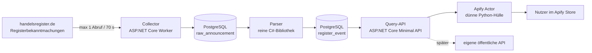

# F1 – Bauspezifikation Actor 1: „Registerbekanntmachungen als Ereignisdaten“

**Stand:** 23.09.2026 · **Ziel:** in 4 Wochen live, mit Preis · Code ist ungetestet und als Gerüst gedacht

---

## 1. Architektur



**Zwei Grundsätze:**

1. **Der Actor spricht nie mit der Quelle.** Er fragt nur deine API. Damit bleibt die Last an der Quelle konstant bei einem Abruf pro 70 Sekunden, egal wie viele Kunden du hast.
2. **Der Parser kennt weder Apify noch HTTP.** Reine Bibliothek, Text rein, Ereignis raus. Genau dieses Stück wanderst du später unverändert in F2.

**Projektstruktur**

```
flow100-register/
├─ src/
│  ├─ Register.Domain/        # Ereignis-Modell, Value Objects, keine Abhängigkeiten
│  ├─ Register.Parsing/       # Klassifizierer + Extraktoren, rein, testbar
│  ├─ Register.Collector/     # HTTP, Rate Limit, robots.txt, Persistenz roh
│  ├─ Register.Api/           # Minimal API für den Actor (und später öffentlich)
│  └─ Register.Data/          # EF Core, Migrationen
├─ tests/
│  ├─ Register.Parsing.Tests/ # Golden Files, Trefferquoten-Report
│  └─ fixtures/               # 100 echte Bekanntmachungen als Testdaten
├─ actor/                     # Apify Actor (Python, dünn)
└─ deploy/                    # docker-compose, Caddy, Backup
```

---

## 2. Datenmodell (PostgreSQL)

```sql
-- Rohdaten: unverändert, so wie geholt. Nie überschreiben, nur ergänzen.
CREATE TABLE raw_announcement (
    id              BIGSERIAL PRIMARY KEY,
    source_url      TEXT        NOT NULL,
    fetched_at      TIMESTAMPTZ NOT NULL DEFAULT now(),
    http_status     INT         NOT NULL,
    content_hash    CHAR(64)    NOT NULL,             -- SHA-256 über den Rohtext
    raw_text        TEXT        NOT NULL,
    published_on    DATE,                             -- aus der Listenansicht
    court_raw       TEXT,
    company_raw     TEXT,
    parse_state     TEXT        NOT NULL DEFAULT 'pending'
                     CHECK (parse_state IN ('pending','parsed','failed','skipped')),
    parser_version  TEXT,
    CONSTRAINT uq_raw_hash UNIQUE (content_hash)      -- Idempotenz
);
CREATE INDEX ix_raw_state       ON raw_announcement (parse_state, id);
CREATE INDEX ix_raw_published   ON raw_announcement (published_on DESC);

-- Registeridentität: der stabile Anker über die Zeit
CREATE TABLE company (
    id                  BIGSERIAL PRIMARY KEY,
    court               TEXT NOT NULL,                -- z. B. "Amtsgericht Charlottenburg"
    register_type       TEXT NOT NULL CHECK (register_type IN ('HRA','HRB','GnR','PR','VR')),
    register_number     TEXT NOT NULL,                -- z. B. "123456 B"
    current_name        TEXT,
    current_legal_form  TEXT,
    first_seen_on       DATE,
    last_seen_on        DATE,
    CONSTRAINT uq_company UNIQUE (court, register_type, register_number)
);

-- Das Produkt: ein Datensatz pro Ereignis
CREATE TABLE register_event (
    event_id            CHAR(64) PRIMARY KEY,         -- deterministisch, siehe unten
    raw_id              BIGINT      NOT NULL REFERENCES raw_announcement(id),
    company_id          BIGINT      REFERENCES company(id),
    published_on        DATE        NOT NULL,
    court               TEXT        NOT NULL,
    register_type       TEXT        NOT NULL,
    register_number     TEXT        NOT NULL,
    company_name        TEXT,
    company_name_norm   TEXT,                         -- kleingeschrieben, Rechtsform abgetrennt
    legal_form          TEXT,
    event_type          TEXT        NOT NULL
                         CHECK (event_type IN ('new_registration','change','deletion',
                                               'liquidation','capital_change','address_change',
                                               'merger','other')),
    event_subtype       TEXT,
    street              TEXT,
    postal_code         TEXT,
    city                TEXT,
    capital_amount      NUMERIC(18,2),
    capital_currency    CHAR(3),
    confidence          JSONB       NOT NULL DEFAULT '{}'::jsonb,   -- Feld → 0.0–1.0
    evidence            JSONB       NOT NULL DEFAULT '{}'::jsonb,   -- Feld → Fundstelle im Text
    parser_version      TEXT        NOT NULL,
    created_at          TIMESTAMPTZ NOT NULL DEFAULT now()
);
CREATE INDEX ix_ev_published ON register_event (published_on DESC);
CREATE INDEX ix_ev_company   ON register_event (court, register_type, register_number);
CREATE INDEX ix_ev_type      ON register_event (event_type, published_on DESC);
CREATE INDEX ix_ev_name_trgm ON register_event USING gin (company_name_norm gin_trgm_ops);

-- Betrieb und Qualität
CREATE TABLE crawl_run (
    id              BIGSERIAL PRIMARY KEY,
    started_at      TIMESTAMPTZ NOT NULL DEFAULT now(),
    finished_at     TIMESTAMPTZ,
    requests        INT NOT NULL DEFAULT 0,
    items_new       INT NOT NULL DEFAULT 0,
    items_duplicate INT NOT NULL DEFAULT 0,
    errors          INT NOT NULL DEFAULT 0,
    stopped_reason  TEXT
);

CREATE TABLE parse_issue (
    id          BIGSERIAL PRIMARY KEY,
    raw_id      BIGINT NOT NULL REFERENCES raw_announcement(id),
    field       TEXT,
    reason      TEXT NOT NULL,
    snippet     TEXT,
    created_at  TIMESTAMPTZ NOT NULL DEFAULT now()
);
```

**`event_id`** = SHA-256 über `published_on | court | register_type | register_number | content_hash`. Damit ist er stabil über Neuläufe, aber verschieden für zwei Meldungen derselben Firma am selben Tag.

**Erweiterung `pg_trgm`** für unscharfe Namenssuche: `CREATE EXTENSION IF NOT EXISTS pg_trgm;`

---

## 3. Der Sammler: höflich per Konstruktion

Die Regeln aus dem Rechtscheck werden nicht „beachtet“, sie werden **erzwungen**. Wenn die Ratenbegrenzung im Code sitzt, kann kein späterer Fehler sie aufheben.

### Politik in Zahlen

| Regel | Wert | Begründung |
|---|---|---|
| Abstand zwischen Abrufen | **70 Sekunden** | ergibt ca. 51 Abrufe/Stunde, Sicherheitsmarge zur Grenze von 60 |
| Abrufe pro Tag | max. 400 | deckt die ca. 300 täglichen Bekanntmachungen ab |
| Laufzeit pro Tag | ca. 6–8 Stunden, nachts | verteilt die Last |
| Bei HTTP 429 oder 403 | **Lauf abbrechen**, Alarm, 24 h Pause | keine Umgehung, kein Retry-Sturm |
| Bei 5xx | 3 Versuche mit 2, 8, 32 Minuten Abstand | normale Störung |
| User-Agent | Produktname + Kontakt-Mailadresse | erkennbar und erreichbar |
| robots.txt | vor jedem Lauf prüfen | Pfad gesperrt → nicht abrufen |

### `PoliteHttpClient` (C#, Gerüst)

```csharp
using System.Diagnostics;
using System.Net;

namespace Register.Collector;

public sealed class PoliteOptions
{
    public TimeSpan MinInterval { get; init; } = TimeSpan.FromSeconds(70);
    public int MaxRequestsPerRun { get; init; } = 400;
    public string UserAgent { get; init; } =
        "FLOW100-RegisterBot/0.1 (+mailto:kontakt@deine-domain.ch)";
}

/// Erzwingt Mindestabstand, Tageslimit und Stopp-Regeln. Einzige Stelle, die nach aussen spricht.
public sealed class PoliteHttpClient(HttpClient http, PoliteOptions opt, ILogger<PoliteHttpClient> log)
{
    private readonly SemaphoreSlim _gate = new(1, 1);
    private readonly Stopwatch _since = Stopwatch.StartNew();
    private long _lastTicks = -1;
    private int _requests;

    public int Requests => _requests;
    public bool Stopped { get; private set; }
    public string? StopReason { get; private set; }

    public async Task<string?> GetAsync(Uri url, CancellationToken ct)
    {
        if (Stopped) return null;
        if (_requests >= opt.MaxRequestsPerRun)
        {
            Stop("request budget reached");
            return null;
        }

        await _gate.WaitAsync(ct);
        try
        {
            await WaitForSlotAsync(ct);

            for (var attempt = 1; attempt <= 3; attempt++)
            {
                using var req = new HttpRequestMessage(HttpMethod.Get, url);
                req.Headers.UserAgent.ParseAdd(opt.UserAgent);
                req.Headers.AcceptLanguage.ParseAdd("de-DE");

                _requests++;
                _lastTicks = _since.ElapsedTicks;

                using var res = await http.SendAsync(req, ct);

                if (res.StatusCode is HttpStatusCode.TooManyRequests or HttpStatusCode.Forbidden)
                {
                    Stop($"blocked with {(int)res.StatusCode}");
                    return null;                       // bewusst kein Ausweichen
                }
                if ((int)res.StatusCode >= 500)
                {
                    var wait = TimeSpan.FromMinutes(Math.Pow(4, attempt) / 2); // 2, 8, 32 min
                    log.LogWarning("Serverfehler {Status} bei {Url}, warte {Wait}", (int)res.StatusCode, url, wait);
                    await Task.Delay(wait, ct);
                    continue;
                }
                res.EnsureSuccessStatusCode();
                return await res.Content.ReadAsStringAsync(ct);
            }
            return null;
        }
        finally { _gate.Release(); }
    }

    private async Task WaitForSlotAsync(CancellationToken ct)
    {
        if (_lastTicks < 0) return;
        var elapsed = TimeSpan.FromTicks(_since.ElapsedTicks - _lastTicks);
        var remaining = opt.MinInterval - elapsed;
        if (remaining > TimeSpan.Zero) await Task.Delay(remaining, ct);
    }

    private void Stop(string reason)
    {
        Stopped = true;
        StopReason = reason;
        log.LogError("Sammler gestoppt: {Reason}", reason);
    }
}
```

### Quellen-Adapter

Die konkrete Abfrage der Bekanntmachungsliste hängt von der Oberfläche des Portals ab. Sie ist JSF-basiert und arbeitet mit Sitzungszustand, das heisst: Du musst dir die Abläufe einmal selbst ansehen. **Genau deshalb steckt sie hinter einer Schnittstelle** — der Rest des Systems bleibt davon unberührt, und wenn sich die Seite ändert, tauschst du nur diesen einen Teil.

```csharp
public interface IAnnouncementSource
{
    /// Liefert Kopfdaten der Bekanntmachungen eines Tages (ohne Volltext).
    IAsyncEnumerable<AnnouncementRef> ListAsync(DateOnly day, CancellationToken ct);

    /// Holt den Volltext zu einer Bekanntmachung.
    Task<string?> FetchTextAsync(AnnouncementRef reference, CancellationToken ct);
}

public sealed record AnnouncementRef(
    string SourceUrl, DateOnly PublishedOn, string? CourtRaw, string? CompanyRaw);
```

**Prüfe zuerst, ob es ohne Browser geht.** Wenn die Liste über normale Anfragen erreichbar ist, bleibt der Sammler schlank. Falls nicht, ist Playwright nötig — dann läuft der Container schwerer, die Ratenbegrenzung bleibt aber identisch.

### Tagesablauf des Sammlers

```
1. crawl_run anlegen
2. robots.txt lesen und Pfade prüfen        → bei Verbot: Lauf beenden
3. Liste des Vortags holen                  → 1 Abruf
4. Für jede Bekanntmachung:
     a) Volltext holen                      → 1 Abruf, danach 70 s Pause
     b) content_hash bilden
     c) bereits vorhanden? → items_duplicate++, weiter
     d) raw_announcement speichern (parse_state = 'pending')
5. Parser-Durchlauf über alle 'pending'
6. crawl_run abschliessen, Kennzahlen melden
```

**Backfill:** Die ältesten noch sichtbaren acht Wochen einmalig einsammeln, mit demselben Limit. Das dauert rund drei Wochen und läuft nebenher — dein Vorsprung entsteht ab Tag eins und wächst danach automatisch.

---

## 4. Der Parser

### Prinzip

Drei Stufen, jede für sich testbar:

1. **Normalisieren:** Zeilenumbrüche, doppelte Leerzeichen, typografische Zeichen, Abkürzungen vereinheitlichen.
2. **Klassifizieren:** Ereignistyp anhand geordneter Regeln. Erste Regel, die greift, gewinnt; jede Regel hat eine eigene Konfidenz.
3. **Extrahieren:** Felder einzeln, jedes mit Konfidenz und Fundstelle. **Nie raten.** Was nicht sicher erkannt wird, bleibt leer und erzeugt einen Eintrag in `parse_issue`.

```csharp
namespace Register.Parsing;

public readonly record struct Field<T>(T? Value, double Confidence, string? Evidence)
{
    public static Field<T> Missing => new(default, 0, null);
    public bool HasValue => Value is not null && Confidence > 0;
}

public sealed record ParsedEvent
{
    public required Field<string> Court { get; init; }
    public required Field<string> RegisterType { get; init; }
    public required Field<string> RegisterNumber { get; init; }
    public required Field<string> CompanyName { get; init; }
    public Field<string> LegalForm { get; init; } = Field<string>.Missing;
    public required Field<EventType> Type { get; init; }
    public Field<string> Subtype { get; init; } = Field<string>.Missing;
    public Field<Address> Address { get; init; } = Field<Address>.Missing;
    public Field<Money> Capital { get; init; } = Field<Money>.Missing;
    public required string ParserVersion { get; init; }
}

public enum EventType
{
    NewRegistration, Change, Deletion, Liquidation,
    CapitalChange, AddressChange, Merger, Other
}

public interface IEventRule
{
    string Id { get; }
    int Order { get; }
    EventType Type { get; }
    double Confidence { get; }
    bool Matches(string normalizedText, out string? evidence, out string? subtype);
}
```

### Regelkatalog (Startpunkt, an echten Texten schärfen)

| Reihenfolge | Regel-ID | Erkennungsmuster (sinngemäss) | Ereignistyp | Konfidenz |
|---|---|---|---|---|
| 10 | `new.registration` | Text beginnt mit „Neueintragung“ | NewRegistration | 0.95 |
| 20 | `deletion.explicit` | „Die Gesellschaft ist gelöscht“, „Von Amts wegen gelöscht“ | Deletion | 0.95 |
| 30 | `liquidation.dissolved` | „Die Gesellschaft ist aufgelöst“, „Liquidator“ | Liquidation | 0.9 |
| 40 | `capital.change` | „Stammkapital“ oder „Grundkapital“ zusammen mit „erhöht“, „herabgesetzt“ oder einem neuen Betrag | CapitalChange | 0.85 |
| 50 | `address.change` | „Geschäftsanschrift“ zusammen mit „geändert“, oder „Sitz verlegt nach“ | AddressChange | 0.85 |
| 60 | `merger` | „Verschmelzung“, „übertragender Rechtsträger“ | Merger | 0.85 |
| 70 | `change.generic` | Text beginnt mit „Veränderung“ | Change | 0.8 |
| 99 | `fallback.other` | alles Übrige | Other | 0.3 |

**Wichtig:** Ein Treffer bei `capital.change` schliesst `change.generic` nicht aus — die Reihenfolge entscheidet, welcher Typ in `event_type` landet, der Rest kann als `event_subtype` mitgegeben werden.

### Feld-Extraktoren

- **Registernummer:** Muster `HRB`/`HRA`/`GnR`/`PR`/`VR` + Ziffern + optionaler Buchstabe. Konfidenz 0.98, wenn zusammen mit einem Gerichtsnamen gefunden.
- **Gericht:** Liste aller Registergerichte als Nachschlagetabelle, nicht per Regex raten. Die Liste einmalig aufbauen und als Datei mitliefern.
- **Firmenname:** bis zum ersten Komma vor der Rechtsform, Rechtsform separat abtrennen (GmbH, AG, UG (haftungsbeschränkt), KG, OHG, GmbH & Co. KG, e.K., eG, SE).
- **Adresse:** PLZ-Muster als Anker, davor Strasse, danach Ort. Nur übernehmen, wenn PLZ und Ort zusammenpassen.
- **Kapital:** Betrag mit Tausenderpunkt und Komma, Währung EUR, historische DM-Angaben markieren statt umrechnen.

### Tests: Golden Files plus Trefferquoten-Report

```
tests/fixtures/
├─ 0001.txt          # Rohtext einer echten Bekanntmachung
├─ 0001.expected.json # von dir geprüfte Sollwerte
├─ …
└─ index.json
```

```csharp
[Theory]
[MemberData(nameof(AllFixtures))]
public void Parser_trifft_erwartete_Werte(string fixtureId)
{
    var text     = Fixtures.ReadText(fixtureId);
    var expected = Fixtures.ReadExpected(fixtureId);
    var actual   = new AnnouncementParser().Parse(text);

    Assert.Equal(expected.EventType, actual.Type.Value);
    Assert.Equal(expected.RegisterNumber, actual.RegisterNumber.Value);
    if (expected.CompanyName is not null)
        Assert.Equal(expected.CompanyName, actual.CompanyName.Value);
}
```

Dazu ein Report, der die **Trefferquote je Feld** ausgibt — das ist deine Qualitätszahl im Store-Listing:

```csharp
[Fact]
public void Trefferquoten_Report()
{
    var rows = Fixtures.All().Select(f => (f, Parse(f))).ToList();
    var report = FieldCoverage.Compute(rows);   // Feld → erkannt / korrekt / falsch
    File.WriteAllText("coverage.md", report.ToMarkdown());

    Assert.True(report.Rate("event_type")      >= 0.95);
    Assert.True(report.Rate("register_number") >= 0.98);
    Assert.True(report.Rate("company_name")    >= 0.90);
}
```

**Zielwerte für das MVP:** Ereignistyp ≥ 95 %, Registernummer ≥ 98 %, Firmenname ≥ 90 %, Adresse ≥ 70 %, Kapital ≥ 80 % der Fälle, in denen es überhaupt vorkommt. Was du erreichst, schreibst du ins README — auch wenn es niedriger ist. Das ist dein Unterscheidungsmerkmal.

---

## 5. Query-API (was der Actor aufruft)

```csharp
app.MapGet("/v1/events", async (
    DateOnly? from, DateOnly? to, string? court, string? eventType,
    string? register, int limit, string? cursor, EventQuery q) =>
{
    var page = await q.SearchAsync(new EventFilter(
        From: from, To: to, Court: court, EventType: eventType,
        Register: register, Limit: Math.Clamp(limit, 1, 1000), Cursor: cursor));

    return Results.Ok(new { items = page.Items, next_cursor = page.NextCursor });
})
.RequireAuthorization("ActorKey");
```

- **Cursor-Paginierung** über `(published_on, event_id)`, keine `OFFSET`-Sprünge.
- **Ein API-Key für den Actor**, als Umgebungsvariable im Apify-Konto hinterlegt.
- Antwortzeit unter 300 ms, weil aus dem eigenen Archiv gelesen wird.

---

## 6. Der Apify Actor (dünn)

```python
import os, httpx
from apify import Actor

API = os.environ["FLOW100_API_URL"]      # https://api.deine-domain.ch
KEY = os.environ["FLOW100_API_KEY"]      # im Apify-Konto als Secret hinterlegt

async def main() -> None:
    async with Actor:
        cfg = await Actor.get_input() or {}
        params = {
            "from": cfg.get("dateFrom"),
            "to": cfg.get("dateTo"),
            "court": cfg.get("court"),
            "eventType": cfg.get("eventType"),
            "limit": 500,
        }
        await Actor.charge(event_name="query_started")

        async with httpx.AsyncClient(timeout=30, headers={"Authorization": f"Bearer {KEY}"}) as http:
            cursor, delivered = None, 0
            while True:
                res = await http.get(f"{API}/v1/events", params={**params, "cursor": cursor})
                res.raise_for_status()
                body = res.json()

                for item in body["items"]:
                    if not cfg.get("includeRawText"):
                        item.pop("raw_text", None)
                    await Actor.push_data(item)
                delivered += len(body["items"])
                await Actor.charge(event_name="event_delivered", count=len(body["items"]))

                cursor = body.get("next_cursor")
                if not cursor:
                    break

        Actor.log.info("Ausgeliefert: %d Ereignisse", delivered)
```

Abrechnung: `query_started` deckt den Fixaufwand, `event_delivered` ist der eigentliche Preis. Prüfe die SDK-Signaturen gegen die aktuelle Doku.

---

## 7. Betrieb

**`deploy/docker-compose.yml`** mit vier Diensten: `postgres`, `api` (ASP.NET Core), `collector` (Worker), `caddy` (TLS). Ressourcen reichen auf dem CX23 locker.

| Thema | Umsetzung |
|---|---|
| Backup | Nächtlich `pg_dump`, mit restic verschlüsselt auf externen Speicher, monatlicher Rückspieltest |
| Überwachung | `/health` prüft DB und letzten erfolgreichen Crawl-Lauf; Uptime Kuma pingt alle 5 min |
| Alarme | Telegram bei: Sammler gestoppt, kein Lauf in 26 h, Fehlerquote im Parser über 10 %, API-Fehler über 1 % |
| Log | Strukturiert, ohne Volltexte; `crawl_run` ist dein Betriebsprotokoll |
| Geheimnisse | `.env` ausserhalb des Repos, niemals committen |
| Deployment | GitHub Actions baut Images, deployt per SSH, Smoke-Test danach |

---

## 8. Woche 1, konkret

| # | Aufgabe | Zeit | Fertig, wenn |
|---|---|---|---|
| 1 | Arbeitsvertrag prüfen (Nebenbeschäftigung, Konkurrenz, IP) | 30 min | Notiz im Projekt |
| 2 | Apify-Konto, KYC, Auszahlung auf PayPal oder Wise | 30 min | Auszahlungsweg bestätigt |
| 3 | Hetzner CX23, Docker, Caddy, PostgreSQL, Repo, CI | 2 h | `/health` antwortet über HTTPS |
| 4 | Portal manuell ansehen: Wie kommt man an die Tagesliste, geht es ohne Browser, was sagt robots.txt | 1.5 h | Entscheid „mit oder ohne Playwright“ dokumentiert |
| 5 | `PoliteHttpClient` plus Quellen-Adapter für **einen** Tag | 2 h | 300 Rohtexte in `raw_announcement` |
| 6 | 20 Bekanntmachungen von Hand ansehen, Ereignistypen notieren | 1 h | Regelkatalog an der Realität geschärft |

**Definition of Done für Woche 1:** Ein Tag Bekanntmachungen liegt vollständig im eigenen Archiv, der Abruf hielt den Mindestabstand ein, und du weisst, welche Ereignistypen tatsächlich vorkommen und wie häufig.

**Rote Linien:** Wenn robots.txt den Bereich sperrt, wenn das Portal blockt, oder wenn ohne Captcha-Umgehung nichts geht — dann stoppst du und wir wechseln auf F2. Das ist kein Scheitern, sondern das Ergebnis, für das Woche 1 da ist.

---

## 9. Reihenfolge nach dem Start

1. **Woche 2–4** wie im Plan: Parser, Actor, Veröffentlichung.
2. **Danach zuerst Qualität, nicht Features.** Trefferquoten hochziehen, Regeln an Fehlern schärfen.
3. **Dann Monitoring-Abo:** feste Firmenliste, tägliche Prüfung, Benachrichtigung per Webhook. Das ist der Schritt von Einmalnutzung zu wiederkehrendem Umsatz.
4. **Dann F2:** Dieselbe API öffentlich, mit eigener Anmeldung und Abrechnung. Der Code dafür existiert dann bereits.
